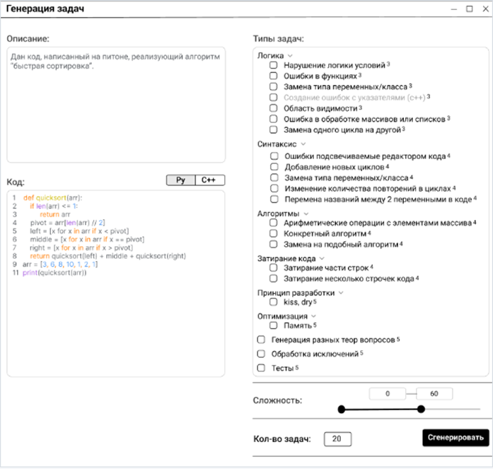
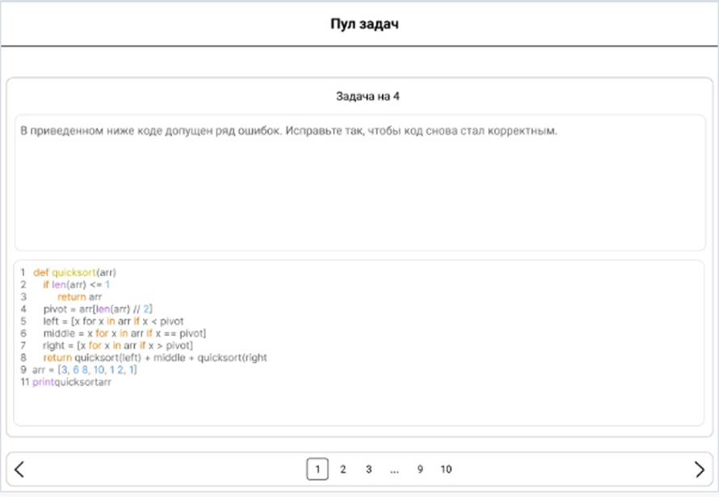

## Оглавление

1. [Итерация 1](#Итерация-1)
2. [Итерация 2](#Итерация-2)
3. [Описание проекта](#Описание-проекта)
3. [Описание коммитов](#Описание-коммитов)
4. [Правила работы с репозиторием](#Правила-работы-с-репозиторием)

## Итерация 1

> ### План
>* Собрать и обработать требования заказчика
>* Изучить теоретический материал
>* Создать макет UI
>* Создать сценарии использования приложения
>### Процесс реализации задач
>Были проведены три встречи с заказчиком. Были составлены протоколы встречи и, как результат, определены цели проекта,
> возможные типы задач, которые необходимо сгенерировать. Цели и типы задач оформлены на wiki-странице и загружены в
> репозиторий.
>
>### Протоколы встреч
>Протокол от 18.02:
>1. Определена цель проекта
>2. Определена суть программы
>3. Определены input и output
>
>Протокол от 22.02:
>1. Даны комментарии о макете
>2. Даны комментарии о предложенных типах задач
>
>Протокол от 26.02:
>1. Даны комментарии по дополненным типам и исправленному макету
>
>### Цели и типы задач
>**Цели проекта:**
> * Оптимизировать время работы преподавателя, это включает в себя создание задач быстрее и более точные
> * Составить алгоритм, который помогает в создании n-количество типов задач
> * Понять, как можно измерить мощность множества задач, которое может быть сформировано в рамках этого количества задач
> * Составить классификацию типов задач, которые возможно генерировать в рамках проекта
>
> **Типы задач:**
> * Синтаксис
> * Логика
> * Алгоритмы
> * Оптимизация
> * Затирание кода
> * Теор. Вопросы
>### Изучение теоретического материала
> Был изучен теоретический материал, который понадобится для выполнения задачи. Результатом изучения стал
> перечень библиотек и статей, которые помогут в написании кода.
> * AST
> * Codegen
> * SpaCy
> * Code BERT
> * NLTK
>### Макет UI
>
> 
>### План на следующую итерацию
> * Определение опорной технологии для реализации проекта и её освоение
> * Создание первого прототипа программы с работающим одним или более типом задач

## Итерация 2

> ### План
> * Определение опорной технологии для реализации проекта и её освоение
> * Создание первого прототипа программы с работающим одним или более типом задач
>### Задачи итерации
> * Реализовать тип Синтаксис, подтип - изменение количества повторений в циклах
> * Реализовать тип Затирание кода, подтип - затирание части строки
> * Реализовать тип Синтаксис, подтип - изменение типа переменных
> * Реализовать тип Логика, подтип - замена знаков в условиях
> * Реализовать тип Логика, подтип - ошибки в возвращаемом аргументе
> * Реализовать тип Синтаксис, подтип - ошибки, подсвечиваемые редактором кода
> * Реализовать main файл
> * Написать сценарий использования
> * Написать и оформить README.md
> * Docker
>
>### План на следующую итерацию
> * Дописать функционал программы (версия 2)
> * Реализовать базовые тесты (интеграционные, функциональные)

## Описание проекта

| Название файла             | Описание                                                                                                                                                                                                                                                     |
|----------------------------|--------------------------------------------------------------------------------------------------------------------------------------------------------------------------------------------------------------------------------------------------------------|
| main.py                    | Основной файл, содержащий классы Changer (управляет экземплярами классов, методы которых изменяют код) и FileDealer (обеспечивает работу с кодом пользователя). Также содержит функцию exec_tree, которая выводит структуру AST-дерева и собирает его в код. |
| changing_iterations.py     | Содержит класс с методами, реализующими задачу изменения количества итераций в цикле for.                                                                                                                                                                    |
| syntax_error_generation.py | Содержит класс с методами, реализующими задачу замены латинских букв на кириллицу в названиях функций.                                                                                                                                                       |
| swap_parameters.py         | Содержит класс с методами, реализующими задачу изменения порядка передаваемых аргументов в функцию.                                                                                                                                                          |
| vars_eraser.py             | Содержит класс с методами, реализующими задачу удаления названия переменных при объявлении или изменения их значения.                                                                                                                                        |
| list_eraser.py             | Содержит класс с методами, реализующими задачу удаления некоторых элементов списка.                                                                                                                                                                          |
| return_eraser.py           | Содержит класс с методами, реализующими задачу удаления части строк кода или нескольких строк кода.                                                                                                                                                          |
| call_params_eraser.py      | Содержит класс с методами, реализующими задачу удаления параметров, которые передаются в функцию.                                                                                                                                                            |
| scope_mistakes.py          | Содержит класс с методами, реализующими задачу создания ошибок, связанных с областью видимости функции.                                                                                                                                                      |
| change_return.py           | Содержит класс с методами, реализующими задачу с неверным возвращаемым аргументом в функции.                                                                                                                                                                 |
| 	replacing_signs.py        | Содержит класс с методами, реализующими задачу замены операторов сравнения.                                                                                                                                                                                  |
| Dockerfile                 | Этот Docker-файл определяет образ, который будет использоваться для создания контейнера, который выполнит скрипт main.py при запуске.                                                                                                                        |

## Описание коммитов

| Название                                                                                                                                        | Описание                                                                                                                                                                  |
|-------------------------------------------------------------------------------------------------------------------------------------------------|---------------------------------------------------------------------------------------------------------------------------------------------------------------------------|
| [added changes: function works correctly](https://github.com/moevm/mse1h2024-task-gen/pull/17/commits/5ee7822325c1176ebf0d19829e89327989d9d552) | Добавление функционала: создание класса с функционалом, который заменяет буквы латинского алфавита на русские в названиях функций                                         |
| [syntax_HEIC_init](https://github.com/moevm/mse1h2024-task-gen/pull/37/commits/6c321fe9079b350b49a82d8bfc5709d0e2290fdf)                        | Обновление документации: изменение документации и метода класса                                                                                                           |
| [001 version](https://github.com/moevm/mse1h2024-task-gen/pull/16/commits/27610b9d09f647b564fca827b8ad267848bb3346)                             | Добавление функционала: в данной версии int -> str и str -> int                                                                                                           |
| [float, bool, None added](https://github.com/moevm/mse1h2024-task-gen/pull/16/commits/20918618404d4ade81a88f1a55faeeaccffa314e)                 | Добавление функционала: float, bool, None added                                                                                                                           |
| [syntax_RT_v.0.1](https://github.com/moevm/mse1h2024-task-gen/pull/28/commits/df884d739ab3449e1bb8f54116165d26610ae9f0)                         | Добавление функционала: замена типы rvalue значений на другие(в данной версии любое на любое, если это поддерживается языком) + проработка типа list                      |
| [syntax_CI_v.0.1](https://github.com/moevm/mse1h2024-task-gen/pull/29/commits/283fa09759d1522fe9b209b6ce9366d6a74266e8)                         | 001 версия подтипа "Синтаксис: изменение кол-ва переменных"Программа изменяет кол-во итераций в цикле for c вероятностью 100%                                             |
| [logic_FM](https://github.com/moevm/mse1h2024-task-gen/pull/38)	                                                                                | Добавление функционала: Изменение порядка аргументов, подаваемых в функцию. Изменение возвращаемого из функции аргумента. Создание ошибки, связанной с областью видимости |
| [deleting_ALL](https://github.com/moevm/mse1h2024-task-gen/pull/39/commits/4db193b79aae33c46f84819c6d422a2787be53ea)                            | Добавление функционала: Добавлена возможность удаления параметров функций, элементов списка, названий переменных                                                          |                                                                                                                                              |                                                                                                                                                                           |

## Правила работы с репозиторием

**Название веток:**
<тип_зазачи>_<подтип_задачи>

**Пример:**
<pre>syntax_HEIC - синтакситеческий тип, подсвечиваемые ошибки в коде (по первым латинским 
буквам (highlighted error incode))</pre>

**Название pull request:**
<тип_зазачи>_<подтип_задачи>_v.<номер_версии>

**Пример:**

<pre>syntax_HEIC_v.0.1
syntax_HEIC_v.0.2
...
syntax_HEIC_v.1.0</pre>

**Дополнительно:**

* В файле создаётся <u>внутренняя документация и комментарии</u>, поясняющие работу в исполняемом файле.

* Код функций пишется в отдельном файле, в main-файл импортируется функция из файла с необходимой функцией.

* <u>Название коммита</u> должно отражать суть изменений. Например: 
  <pre>git commit -m "feat: add line output"          # en, добавьте вывод строки
  git commit -m "feat: добавьте вывод строки"    # ru</pre>